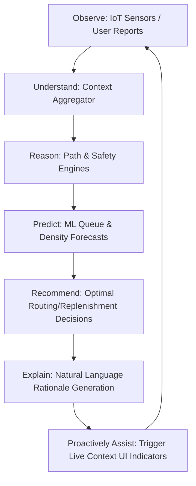

# FIFA Synapse: AI Decision Intelligence Platform for Smart Stadiums

<p align="center">
  
</p>

<p align="center">
  <a href="https://github.com/google/ai-studio-build"></a>
  <a href="https://react.dev/"></a>
  <a href="https://www.typescriptlang.org/"></a>
  <a href="https://tailwindcss.com/"></a>
  <a href="https://firebase.google.com/"></a>
</p>

---

## 📌 Project Overview
**FIFA Synapse** is an enterprise-grade **AI-powered Decision Intelligence (DI)** platform engineered specifically for world-class smart stadiums. Built on a full-stack architecture of React, Node.js/Express, Firebase, and Google Maps, it orchestrates real-time telemetry inputs (crowd density, wait times, safety incidents, food inventory) into actionable intelligence.

Rather than merely recommending the *geographically nearest* option, FIFA Synapse runs the **Synapse Intelligence Loop** to evaluate multi-vector variables and guide fans, staff, and organizers toward the *smartest, context-aware decisions*.

---

## ⚠️ Problem Statement
During massive sporting spectacles, traditional stadium infrastructure struggles with **cognitive overload** and **static spatial allocation**:
* **Inefficient Routing:** Legacy navigation maps direct users down static, congested corridors, exacerbating bottlenecks at exit gates (egress).
* **Concession Queuing Bottlenecks:** Fans flock to the physically nearest concessions, causing 25+ minute queues while under-utilized counters nearby remain empty.
* **Reactive Safety Incident Operations:** Volunteers, staff, and emergency coordinators operate in siloes, responding to incidents only after they escalate.
* **Inventory Mismanagement:** Concessions run out of popular items dynamically, without proactive predictive stock replenishment indicators.

---

## 🎯 Platform Vision
FIFA Synapse transitions sports arenas from passive concrete structures into proactive, self-optimizing spaces:
* **For Fans:** Frictions of waiting in line, getting lost, and getting stuck in crowd congestion are fully eliminated.
* **For Organizers:** Micro and macro-level real-time stadium health scores can be observed instantly, with automated emergency routing control overrides.
* **For Operations:** Live crowd incidents can be reported, dispatched, and tracked dynamically with large mobile touch targets.
* **For Venue Staff:** Predictive inventory trackers provide dynamic stock warnings and real-time replenishment guidance.

---

## 🌟 Key Features

### 1. Smart Multi-Modal Navigation
* Real-time routing computations utilizing the advanced Google Maps Routes API.
* Intelligent crowd avoidance paths mapped out dynamically via sector occupancy sensors.
* Specialized toggle-based routes optimized for wheelchair and stroller accessibility.

### 2. Live Crowd Heatmaps & Telemetry
* Visual sector maps tracking live densities, flow rates, and safety levels.
* Proactive congestion warning alerts pushing smart diversion plans directly to active navigation guides.

### 3. Smart Queue & Concession Load Balancing
* Wait-time estimators tracking register speeds, category parameters, and customer inflow.
* Interactive menus indicating certified Halal, Vegan, and Allergy-friendly dietary items.

### 4. Enterprise Operations Dispatch Center
* Live incident tracker for reporting facilities failures, medical emergencies, or security breaches.
* Instant task queue assignment workflows with one-touch updates for volunteers.

---

## 🧠 AI Capabilities & Orchestration Core
At the heart of the platform is the **Synapse Core**, a robust server-side intelligence gateway utilizing the official `@google/genai` TypeScript SDK. Visual components never make direct API calls to Gemini. Instead, components request structured recommendations via safe backend endpoints.

```
                  +-----------------------------------+
                  |        UI Presentation Component  |
                  +-----------------------------------+
                                    |
                                    v [1. Requests Recommendation]
                  +-----------------------------------+
                  |          useSynapse() Hook        |
                  +-----------------------------------+
                                    |
                                    v [2. Invokes Endpoint]
                  +-----------------------------------+
                  |     SynapseCore (Express Backend) |
                  +-----------------------------------+
                   /                |                \
                  /                 |                 \
                 v                  v                  v
       +-------------+       +-------------+     +-------------+
       | Crowd Agent |       | Route Agent |     | Food Agent  |
       +-------------+       +-------------+     +-------------+
                  \                 |                 /
                   \                |                /
                    v               v               v
                  +-----------------------------------+
                  |       Google Gemini Pro API       |
                  +-----------------------------------+
```

### 📋 Recommendation JSON Contract Example
All backend recommendation payloads conform to standard, strictly typed TypeScript interfaces:

```typescript
export interface SynapseRecommendation<T> {
  action: T;                 // The smart recommendation
  alternative: T;            // The backup option
  reasoning: string[];       // Logical / mathematical justification
  expectedOutcome: string;   // Wait-time or distance reduction estimate
  confidence: number;        // Accuracy metric (0.0 - 1.0)
}
```

---

## 👥 Target Roles (Multi-Tenant RBAC)
FIFA Synapse employs strict Role-Based Access Control to adapt the layout and functionalities based on who is logged in:

| User Role | Core Focus | Primary Visual Screens |
|---|---|---|
| **Fan** | Spatial guidance, concession orders, seat pathways. | Dynamic navigation maps, Concession finder, Personal transit tickets. |
| **Organizer** | Macro stadium status, emergency overrides, mass broadcasts. | AI Command Center, Stadium Health score indicators, Congestion heatmaps. |
| **Operations** | Fast incident resolution, volunteer task queue management. | Active Incident Queue, Task dispatcher board, Push alert controls. |
| **Venue Staff** | Concession queue times, inventory stock levels. | Stock status monitors, Speed-of-service trackbars, Replenishment alerts. |

---

## 🏗️ System Architecture
FIFA Synapse follows a **Feature-Based Clean Architecture** separating concerns down to highly testable vertical slices:

```
+-----------------------------------------------------------------------+
|                              UI LAYER                                 |
|            (Vite, React 19, Tailwind CSS v4, Motion CSS)              |
+-----------------------------------------------------------------------+
                                   |
                                   v
+-----------------------------------------------------------------------+
|                           REACT HOOKS LAYER                           |
|       (useGeolocation, useInterval, useSynapse, useStadiumContext)    |
+-----------------------------------------------------------------------+
                                   |
                                   v
+-----------------------------------------------------------------------+
|                    SYNAPSE AI ORCHESTRATION GATEWAY                   |
|  (IntentEngine, DecisionEngine, PromptBuilder, ResponseParser, Caching)|
+-----------------------------------------------------------------------+
                                   |
                                   v
+-----------------------------------------------------------------------+
|                           SERVICES LAYER                              |
|   (authService, dbService, mapsService, InsightPrioritizationService)  |
+-----------------------------------------------------------------------+
                                   |
                                   v
+-----------------------------------------------------------------------+
|                         REPOSITORIES LAYER                            |
| (UserRepository, CrowdRepository, FoodCourtRepository, IncidentRepo) |
+-----------------------------------------------------------------------+
```

---

## 🔁 Synapse Intelligence Loop (AI Workflow)
The system operates on an intelligent loop to ingest real-time data and output explainable assistance:



---

## 🛠️ Technology Stack
* **Frontend Library:** [React 19](https://react.dev/)
* **Static Typing:** [TypeScript 5.8](https://www.typescriptlang.org/)
* **Build Tool & Bundler:** [Vite v6](https://vitejs.dev/) & [Esbuild](https://esbuild.github.io/)
* **Styling Framework:** [Tailwind CSS v4](https://tailwindcss.com/)
* **Interactive Maps Engine:** [Google Maps Web Components](https://github.com/googlemaps/web-components) & `@vis.gl/react-google-maps`
* **Real-time Synchronization:** [Firebase Firestore](https://firebase.google.com/)
* **User Authentication:** [Firebase Auth](https://firebase.google.com/)
* **AI Engine SDK:** Official Google GenAI SDK (`@google/genai`)
* **Micro-Animations:** [Motion for React](https://motion.dev/)
* **Backend Runtime:** Node.js, Express, and [TSX compiler](https://github.com/privatenumber/tsx)

---

## 📂 Folder & File Structure
```
/
├── .env.example                # Config guidelines for secret API keys
├── index.html                  # Core HTML file serving Vite app
├── metadata.json               # Platform configuration metadata
├── package.json                # Project dependencies and script declarations
├── server.ts                   # Express Backend & Vite dev proxy middleware
├── src/
│   ├── main.tsx                # Client initialization entry-point
│   ├── App.tsx                 # Core App layout wrapper
│   ├── index.css               # Global CSS v4 and Tailwind @import rules
│   │
│   ├── app/                    # Providers, main router configs
│   ├── ai/                     # Synapse AI Orchestration Core
│   │   ├── orchestrator/       # Synapse Core gateway logic
│   │   ├── agents/             # Targeted agent workers (Crowd, Route, Food, etc)
│   │   └── prompts/            # Grounding prompt templates
│   │
│   ├── components/             # Stateless UI & feedback components
│   │   ├── ui/                 # Atomic design tokens (Button, Input, Badge, Card)
│   │   ├── map/                # SmartStadiumMap Google Map wrappers
│   │   └── feedback/           # Accessible loaders, alerts, and modals
│   │
│   ├── features/               # Highly decoupled functional slices
│   │   ├── auth/               # RBAC login & register modules
│   │   ├── commandcenter/      # Organizer AI dashboard & health monitors
│   │   ├── crowd/              # Crowd heatmaps & occupancy alerts
│   │   ├── emergency/          # Panic alerts & fast evacuation routing
│   │   ├── fan/                # Fan concession maps & directions guides
│   │   ├── operations/         # Volunteer incident reporting task lists
│   │   └── staff/              # Inventory management & replenishment indicators
│   │
│   ├── layouts/                # Role-adaptive nav sidebars
│   ├── pages/                  # Route views (LandingPage, DashboardPage)
│   ├── routes/                 # Navigation guards & protected routers
│   ├── services/               # Infrastructure abstraction managers
│   ├── repositories/           # Abstract Firestore data CRUD layers
│   ├── types/                  # Shared domain contract interfaces
│   └── tests/                  # Structure-matching test suites
```

---

## ⚙️ Installation & Setup

### Prerequisites
* Ensure [Node.js v18+](https://nodejs.org/) is installed on your local machine.

### Setup Instructions
1. **Clone the repository and enter the directory:**
   ```bash
   git clone https://github.com/your-org/fifa-synapse.git
   cd fifa-synapse
   ```

2. **Install all necessary packages:**
   ```bash
   npm install
   ```

3. **Configure Environment Variables:**
   Duplicate `.env.example` to create `.env` and fill out your keys:
   ```bash
   cp .env.example .env
   ```

---

## 🔑 Environment Variables
Your `.env` file should configure the following values. Keep your secrets safe; never commit actual keys to git repository branches:

```env
# Google Gemini API key used in server-side SynapseCore proxy
GEMINI_API_KEY="AIzaSyYourGeminiAPIKeyGoesHere"

# Self-referential URL where the web app is hosted (used for callbacks and endpoint routes)
APP_URL="http://localhost:3000"

# Google Maps API key loaded securely via standard client components
GOOGLE_MAPS_PLATFORM_KEY="AIzaSyYourMapsPlatformKeyGoesHere"
```

---

## 🚀 Running the Project

### Development Server
Starts the Express server with `tsx` compiler and integrated Vite proxy middleware, binding automatically on port `3000`:
```bash
npm run dev
```
Open your browser to `http://localhost:3000`.

### Production Build & Execution
1. **Bundle and compile client assets and server bundle:**
   ```bash
   npm run build
   ```
2. **Start standalone server hosting the built app:**
   ```bash
   npm run start
   ```

---

## 🧪 Testing Framework
FIFA Synapse includes a custom, robust testing framework situated within `src/tests/` to audit code, resilience patterns, accessibility guidelines, and system load.

### To execute type checks and lints:
```bash
npm run lint
```

### Coverage Scope:
* **Synapse Core:** Intent categorization, Prompt compilation, Response parsing resilience.
* **Component Verification:** LiveAlertPanel states, StadiumHealthCard indicators, dynamic atomic buttons, and input validations.
* **Error Resilience:** Graceful stubs and fallbacks during Firestore timeouts or Gemini API rate limit limits.
* **Accessibility (A11y) Verification:** Mathematical hex contrast calculators, touch dimensions, and ARIA labels.
* **Performance Stress Tests:** High-density crowd calculations (500+ sectors) and rapid debouncers.

---

## ♿ Accessibility (A11y) Standards
FIFA Synapse strictly adheres to **WCAG AA guidelines** to guarantee the app is safe, equitable, and navigable:
* **Pristine Color Contrast:** All elements are checked with a mathematical relative luminance calculator, securing a contrast ratio higher than `4.5:1` for normal text, and `3.0:1` for muted descriptions.
* **Touch-Target Sizing:** All mobile-accessible button targets maintain a minimum dimension of **44x44px** to protect against mis-clicks.
* **Semantic Code & ARIA:** Strict semantic landmarks (`<main>`, `<header>`, `<nav>`) are combined with `aria-busy` and `aria-label` tags.
* **Accessible Motion:** Staggered transitions and visual prompts fully support OS-level reduced motion preferences.

---

## 🔒 Security & Data Compliance
* **PII Isolation:** Personally Identifiable Information is separated securely from public indices using a decoupled subcollection structure (`/users/{uid}/private/info`).
* **Firestore Security Rules:** Access rules employ schema validation and read limits to ensure users cannot view or manipulate fields outside their authorized role profile.
* **Server-Side Masking:** API keys for AI services are handled exclusively inside the Express backend context; keys are never exposed in raw network headers or bundle codes.

---

## 🔮 Future Enhancements
* **Predictive ML Routing Models:** Training deep neural networks directly on historical match egress times to predict path congestion 45 minutes in advance.
* **Smart IoT Concession Integrations:** Wearable or visual weight-sensors linked automatically to stock counts for real-time item depletion alerts.
* **Stadium Acoustic Intelligence:** Dynamic noise sensors feeding real-time decibel analysis back to organizers to trigger localized volume alerts.

---

## 📄 License
This project is licensed under the Apache License 2.0. See the `LICENSE` file for more details.

---
*FIFA Synapse: Smart Stadium Intelligence, Designed for Scale.*
